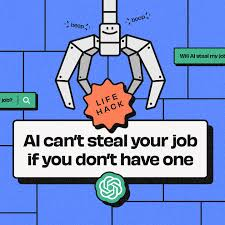

 

### I. Introduction
In a world where AI is used almost everyday, using it to one's advantage has its pros and cons. AI can be an extremely helpful tool in educational assistance as it can explain questions to students in many ways. It can also save time with making writing better and calculate math problems, however, this is known to be academic misconduct. In software engineering, AI assists programmers in the form of coding assistants such as Co-pilot or Chatgpt. Most of the time, AI is able to spot and fix errors in code that would normally take people a few minutes to catch. From personal experience, I have incorporated ChatGPT into my daily life whenever I wanted thorough explanations on questions I want to ask or fix small bugs. Overall, it saves time in debugging and even adds comments to explain new implemented code.

### II. Personal Experience with AI
1. Experience With WODS
WODS have been an excellent way of testing our programming knowledge based on what we have learned in class. Completing a WOD successfully without the need of AI feels more accomplishing than asking for help. I haven't not used any AI tools to experience WODs due to my willingness to learn about class material and figure it out myself. In addition, the experience WODs came with a video tutorial that walks you through it which is supplemental to completing the experience. 

2. In-class Practice WODs
I have used AI for some of in-class practice WODs. This is because there were several times where me and my partner were stuck and didn't realize the errors in our code. The AI tools were our last option to try fixing our erros if we couldn't find them ourselves. Since the In-class practice WODs were supposed to be similar to the real WODs, I still wanted to treat it no differently since the learning outcome was the same.

3. In-class WODs
During the first half of the semester, I didn't need AI tools for the WODs as they focused on implementing algorithms and data structures, which I had already learned in previous classes. However, as the WODs shifted towards web development, I found myself in need of AI assistance, especially for tasks involving unfamiliar tools like linking pages and formatting them nicely.

4. Essays
Using AI for essays has been a huge help ever since english 100. Before Chatgpt, I revised my essays with Grammarly, which had a built-in AI tool to revise my sentances. When Chatgpt was released, I switched to using it to revising my essays as it was more robust and helped me brainstorm ideas for my essays. The consequence I face when revising essays with AI is the lack of authenticity. As my professors say, "Make sure it is your voice" is a strong point explaining that your essays should still hold uniqueness even though it was revised. With that in mind, I ensure that any adjustments made in an essay are revised by me.  

5. Final Project
For our final project, ChatGPT helped mostly on developing front-end code since it was easier to learn. The downside that my group and I realized is that AI tools can't determine the features that need to be added for functionality. We had also realized doing the practice WODs are essential to creating website functionality.

6. Learning a Concept / Tutorial
I use AI to learn a concept often. Whenever I don't understand concept, asking AI to explain it to me in a simple way has been beneficial. Chatgpt is able to provide answers in great detail as well as examples. 

7. Answering a question in class or in Discord
I have not answered any questions in class or in Discord. Usually, there is someone much more knowledgeable who answers the questions way before I even see them so I don't think there is a need for AI.

8. Asking or answering a smart-question
On several occasions, I've found myself needing to ask a smart question. Yet, it often happens that my classmates with the same question beat me to it. Observing their method of questioning has inspired me to ask smart questions in other classes.

9. Coding example
ChatGPT proves to be helpful when seeking coding examples. Specifically, I often ask for examples related to data structures or algorithms, and ChatGPT reliably provides detailed, step-by-step instructions and comprehensive explanations.

10. Explaining code
I have also used AI often for this. For example, I was provided a client-server program with a hundred lines of code, and being able to paste it into ChatGPT to explain each crucial part of the code was helpful. 

11. Writing code
I have used AI to write code for programs that I have little knowledge about. Usually, I want to figure things out on my own since I learn it better, but there are times when I am confused and lost. This is where ChatGPT can assist me by generating something that I look over and understand before I use it.

12. Documenting code
I haven't thought about doing code documentation using AI. If I understand the lines of code that I am adding, I add comments myself which help other programmers understand the program.

13. Quality assurance
With experience from ESLint, AI has also been helpful in fixing bugs and errors. There have been times where Chatgpt and ESLint have helped me create the best possible code there is according to coding standards. This has mostly fixed spacing errors and missing semicolons. 

14. Other uses in ICS 314 not listed
Apart from ICS 314, I've also used AI for help in EE315 and EE323, both of which are electrical engineering courses. EE315 is about signals and systems, tackling math-intensive subjects. Occasionally, AI may encounter errors when computing signal outputs, with the need for manual verification on my part. Similarly, in EE323, a microelectronics course, I've encountered similar challenges. However, using AI in these classes offers the advantage of correctly setting up equations, facilitating easier verification and validation of results. 

### III. Impact on Learning and Understanding
When I use AI, I aim to understand the problem and provide me with options on how to solve the problem. I feel this way is quite beneficial to learning as it can be treated as a supplement to the topics that we learn. 

### IV. Practical Applications
One practical application I use AI for is in my VIP project. Here, we are tasked with creating a 'dataset vending machine' that dispenses parsed .csv data depending on the user's requests. My partners and I got helped in creating an index.html file, css file, and csv parser file which was the main file needed for the site's functionality. 

### V. Challenges and Opportunities
AI has been both beneficial and detrimental from the way I see it. Since the release of Chatgpt, I have noticed that there is a strong urge to ask ChatGPT for an answer instead of asking to learn about the problem itself. It has somewhat defeated the purpose of assignments in the sense that an answr can be fetched instantly. Despite this, AI still has many pros overall if used effectively as a learning reinforcement rather than an answer dispenser.

### VI. Comparative Analysis
I think that our lives before Chatgpt were perfect the way it is. Having to search the internet for an answer to your question gave a greater learning outcome than asking Chatgpt because you spent more effort in searching for the answer and learning about it yourself rather than having it be said to you immediately. As for learning, traditional professors and class teaching styles are more effective in my opinion. It provides class engagement with others in learning. Additionally, the traditional teaching method allows for social interaction such as reaching out to a professor or classmate. Using a language model like ChatGPT tends to isolate people when they have questions.

### VII. Future Considerations
I consider AI to a significant role in the future of software engineering and future generations. One thing to consider is the lack of human interaction which I believe people still need. There will be solutions to improving AI to be more enjoyable based on the amount of feedback we give to it.

### VIII. Conclusion
In brief, AI is very effective if it is used properly. If you know that the outputs that Chatgpt gives are only approximations, then that knowledge will help you validate your own solutions to a problem. I have seen how detrimental AI can be if not used effectively. While it's an excellent choice to trust AI in learning or solving problems, it should be known that other sources are availible to look from if you are unsure. 

Note: ChatGPT attributed in fixing grammar, vocabulary and punctuation.
