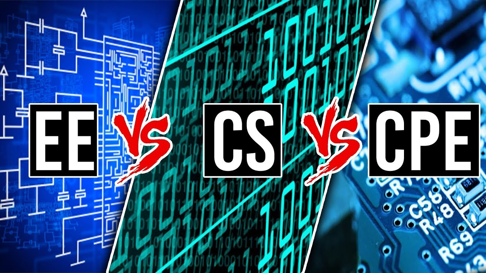

## The Age of Smart Devices
During my freshman year in high school in 2016, I was one of those students who enrolled in various classes only to fulfill credit requirements. However, a shift occurred that year. I observed my friends and family using smartphones and other smart devices. In 2016, smartphones were deemed a luxury and a trend, with companies eagerly introducing new features. I consider it a golden age for smartphones. Students owned a variety of smartphones, including iPhones, Galaxies, LGs, and Xperias, to name a few. Their designs intruiged me as I observed these devices being used. This realization sparked my inspiration to be involved in shaping the future of smartphone designs. Since then, I have been collecting various smartphones and studying their internal specifications and software.

## Best of Three Worlds

In pursuit of these goals, gaining practical experience is as crucial as theoretical knowledge. I am eager to involve myself in internships, collaborative projects, and open-source contributions. These experiences are invaluable in providing real-world context to the concepts learned in the classroom, and in developing a pragmatic approach to problem-solving. Additionally, I am particularly interested in participating in coding hackathons and tech meetups, which I believe are excellent platforms for learning, networking, and staying updated with the latest industry trends.

## Conclusion: The Road Ahead

In summary, my journey in software engineering is guided by a deep-seated passion for technology and an earnest desire to contribute meaningfully to this ever-evolving field. By honing my technical and soft skills, and immersing myself in practical experiences, I aim to not only achieve personal growth but also make a positive impact in the realm of software development. The road ahead is challenging, yet exciting, and I look forward to every step of this continuing journey.

###### PS: ChatGPT helped in creating chatchy titles and with grammar, vocabulary and punctuation.
