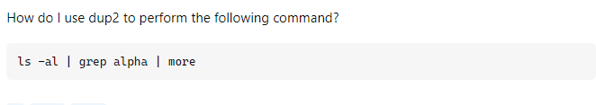
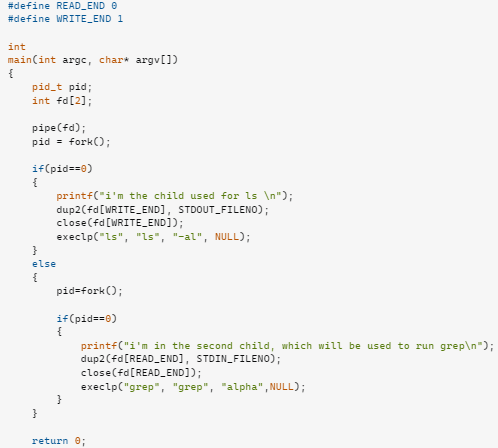

## Questioning a question
In a world full of curiosity, many of us instinctively turn to our mentors or professors when faced with challenges, often without giving a second thought. However, with the help of the internet and AI as resources, the methods of asking questions have undergone changes. For instance, a student may inquire about resolving a coding issue, but the manner in which they frame the question often becomes open-ended if they don't explain what they've done so far. In such cases, the professor is likely to respond by prompting the student to share their efforts they've taken so far in addressing the issue. This becomes the basis for the professor to guide the student in understanding their mistake more clearly. Conversely, when no prior work is presented, the professor may perceive the question as vague, leading to a less helpful response for the student. Now, a method exists for posing questions that benefit both the student and the professor which is asking smart questions.

## Asking a smart question
As sophisticated as code can be, posing an intelligent question is appreciated by those being asked, as it demonstrates your dedication and comprehension of the issue. A number of examples are found on Stack Overflow, a website dedicated to helping programmers with code. Here is an example of an intelligent question that someone had about socket programming. It happened to be a question I wanted to ask when I was struggling to understand the functionality of a client-server program.

https://stackoverflow.com/questions/3642732/using-dup2-for-piping

