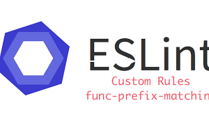

## More Than Just Etiquette
My former professor, who taught me object-oriented programming, once shared with his class, "Writing code is supposed to tell a story." Initially, I didn't fully grasp the meaning behind his words. However, as we progressed through various programming assignments throughout the semester, his statement gradually made more sense. Coding adheres to a set of standards within the development community, enforced for everyone to follow. However, the uniqueness in each person's programming approach can occasionally clash with these standards. 

## What makes Coding Standards Standard?
Coding standards aim to help programmers set up their code in a manner that is easily readable, whether they are an expert or a beginner. This would significantly benefit working environments, particularly when multiple software engineers are collaborating on the same project. Moreover, adhering to coding standards would result in fewer errors and better maintenance for teams. On the other hand, in the context of a smaller work environment, coding standards shouldn't necessarily be as strict. By enforcing less rigid coding standards, this can allow for greater creativity and provide developers with the freedom to code in a way that aligns with their preferences.

## ESLint partnership
In the initial stages of using IntelliJ for code development, ESLint's standards for checking my JavaScript programs initially felt somewhat intimidating, especially as I prefer spacing to neatly organize my functions. However, I was aware that a professional coding environment typically favors less spacing in code. What I found valuable about ESLint was its ability to locate and fix errors in my functions, such as identifying missing semicolons or brackets, which can be challenging to spot at times. Reflecting on this experience, I believe that ESLint has played an important role in helping me overcome certain coding habits, ultimately contributing to my growth as a more efficient programmer.

