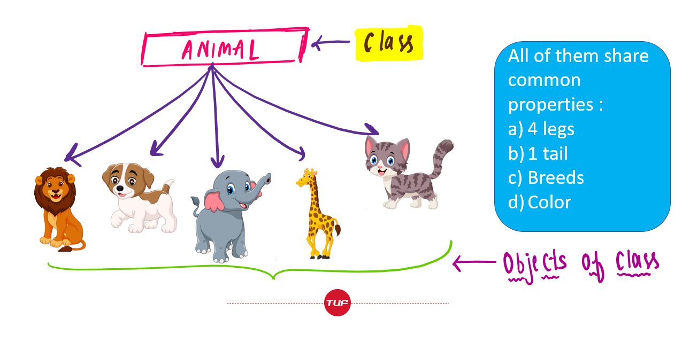

## From Procedural to Object-Oriented 
Animal Farm is a semester-long project from EE 205. It consists of smaller projects that build upon each other and teach the basics of C and C++. We learned to use tools like Git/GitHub, CLion IDE, and the command line to practice good software engineering habits. Upon the completion of each lab, it would then be pushed onto GitHub for documentation.

The labs start off quite simple, introducing the very basics of C and C++. As we moved on further into the semester, we learned about classes, data structures, and database functions which we implemented into Animal Farm. Here are the different versions of Animal Farm we worked on and the requirements of each:
- Animal Farm 0 - Implement an array-based database of cats, where each attribute is an array
- Animal Farm 1 - Change the cat's attributes from arrays into structs
- Animal Farm 2 - Implement a procedural singly linked-list database of cats, where each cat is an object
- Animal Farm 3 - Implement a collection class that implements a singly linked database of Animal objects using: An abstract list, a concrete singly linked list, and a generic Node. Additionally, add an abstract Animal (which also inherits from Node) & Mammal to the Cat object model.

The Animal Farm project can be found [here](https://github.com/byrongs/ee205_lab_08d_animal_farm_1_to_clion.git)
