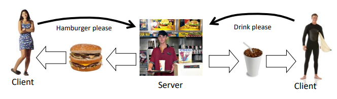
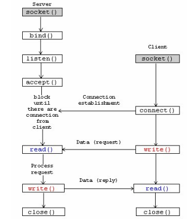
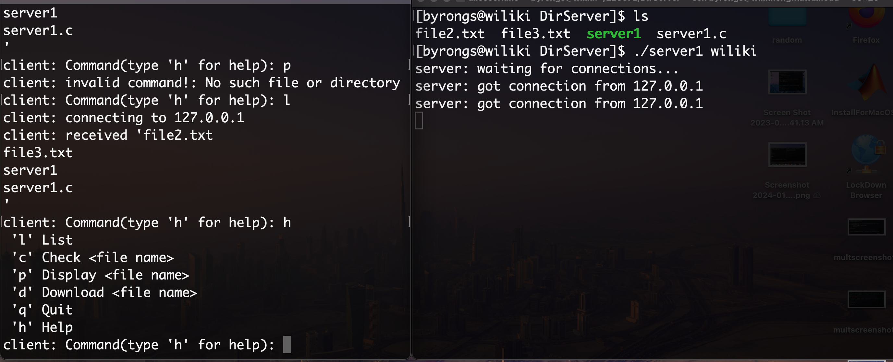

## An Intro to Processes

In this project, I had the opportunity to create both a client and a server which required me to learn socket programming. The server, acting as a responsive entity, patiently awaits requests or commands. Upon receiving a request, it processes the request and promptly returns a thoughtful reply. The client is the counterpart in this dynamic interaction, responsible for initiating requests. As their names imply, their functions closely resemble those of a client and server in a restaurant setting, where the client orders an item, and the server fulfills the request by delivering the chosen item back to the client. Below is a visual representation illustrating this dynamic process. 

## A New Kind of Programming
The most crucial part to making this project work was implementing processes correctly. A process is a running program, which includes
the executable program (or machine program), the CPU and the memory to store data. The “state” of the computer are the values stored in the variables in memory (static global variables, and variables in the heap and stack), and registers in the CPU. Processes also create processes which require system calls to manage these. Some system calls that I used were fork(), exit(), and wait() to name a few. We also implemented pipes which allows for multiple processes to work together. It serves as a memory buffer in the computer that multiple processes can
access. Data is entered and retrieved from the pipe with systemcalls such as read() and write(). Once this was done, we also had to create sockets for communicating between processes on a network. This would establish a connection between machines. Below is a diagram of ClientServer.

Below shows a brief demonstration of how the ClientServer works.
First, two terminals must be opened either on the same or different machine. If it is a connection between two machines, they must both be connected to the wiliki network. the connection is established by typing "./client wiliki" on one machine and "./server wiliki" on the other one in which "wiliki" is the hostname.

The client side is on the left and has a display of commands that it will accept from the server until it quits. The connection was also tested by having text files sent from the server to the client with the download command. Once the download has been completed, the client can use the display command to check if the text file was downloaded or not.

[You can read more here](https://drive.google.com/file/d/1G7A8eHl_FFA-4rRvzPcY3w34Gc5OuZGp/view)
