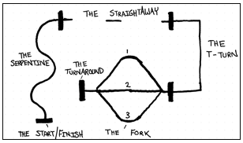

Over the course of several weeks, I worked with a team of selected classmates to build and program a line-following robot from scratch. The project emphasized hands-on skills such as chassis assembly, soldering, wiring, and subsystem integration. We incrementally developed and tested key components, including sensors and motor control systems, while also refining our code through multiple iterations. The final weeks were dedicated to tuning the robot's performance for speed and accuracy, culminating in a scored competition where the robot navigated a course autonomously. The experience provided valuable insights into robotics, embedded systems, and team-based engineering.

<div class="text-center p-4">
  
</div>

For this project, I was the lead programmer who was responsible for programming the various capabilities of the mouse.  I started by programming the basics, such as sensor polling and motor actuation using interrupts.  From there, I then programmed the basic PD controls for the motors of the mouse.  The PD control the drive so that the mouse would stay centered while traversing the maze and keep the mouse driving straight.  I also programmed basic algorithms used to solve the maze such as a right wall hugger and a left wall hugger algorithm.  From there I worked on a flood-fill algorithm to help the mouse track where it is in the maze, and to map the route it takes.  We finished with the fastest mouse who finished the maze within our college.

Here is some code that illustrates how we read values from the line sensors:

```cpp
byte ADCRead(byte ch)
{
    word value;
    ADC1SC1 = ch;
    while (ADC1SC1_COCO != 1)
    {   // wait until ADC conversion is completed   
    }
    return ADC1RL;  // lower 8-bit value out of 10-bit data from the ADC
}
```

You can learn more at the [UH Micromouse News Announcement](https://manoa.hawaii.edu/news/article.php?aId=2857).
