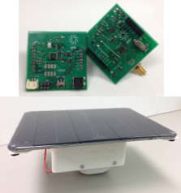
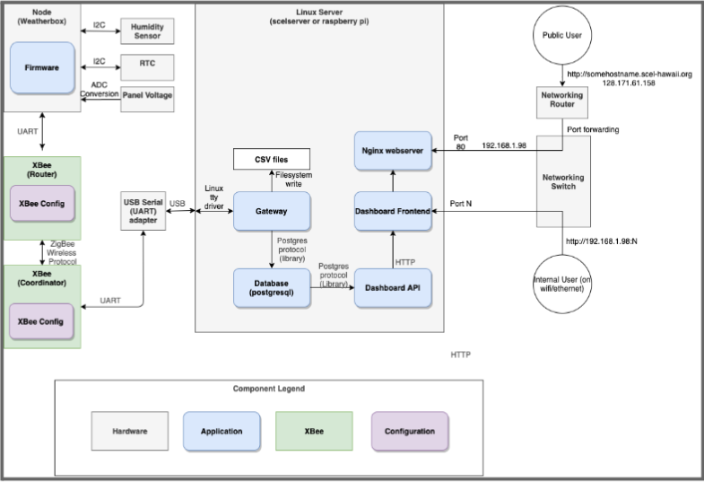
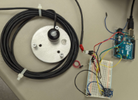

  
  
  

Smart Campus Energy Lab (SCEL) at UH Manoa is a project focused on creating weatherboxes – hardware with various sensors in weatherproof casings. These weatherboxes gather meteorological data such as solar radiance, temperature, and humidity. This data is then used to train a machine learning model for forecasting weather, optimizing the placement of solar panels on campus. With this technology, UH Manoa strives to move towards 100% sustainability. In a bigger picture, Hawaii aims to be 100% renewable by 2045, and this technology can be used to maximize renewable energy in terms of cost statewide.

I was in the firmware team of this project and our responsibility was to maintain and update code for weatherboxes. We were also tasked with researching new sensors to implement in our weatherbox systems for future teams. In Spring semester of 2023, my team worked on developing a data pipeline. This pipeline automates the process of structuring the software in new hardware models as they will all follow the same unified schema. This will allow for simple data management and manipulation in the databases as all weatherbox versions will have the same formatting. To develop this feature, we used SQL, Python, C, and C++ to work on Arduino code.

You can learn more at the [Smart Campus Energy Lab](https://wiki.scel-hawaii.org/doku.php).
